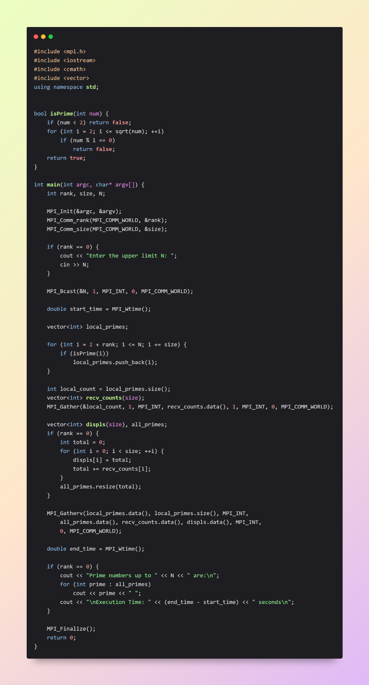
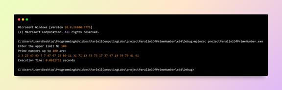
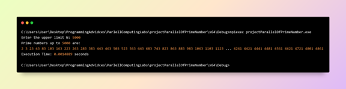
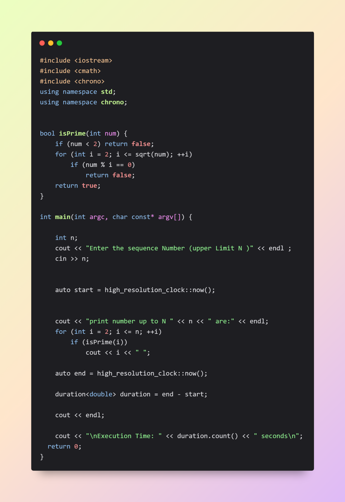
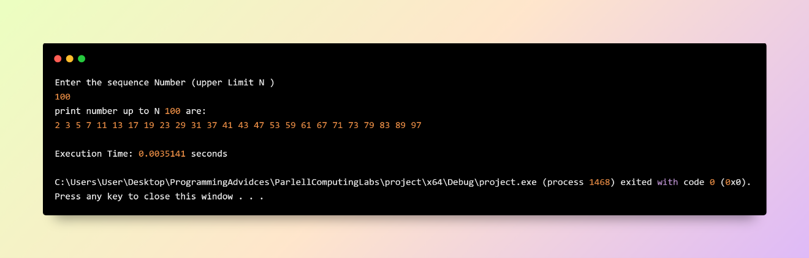
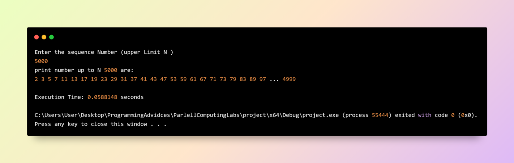
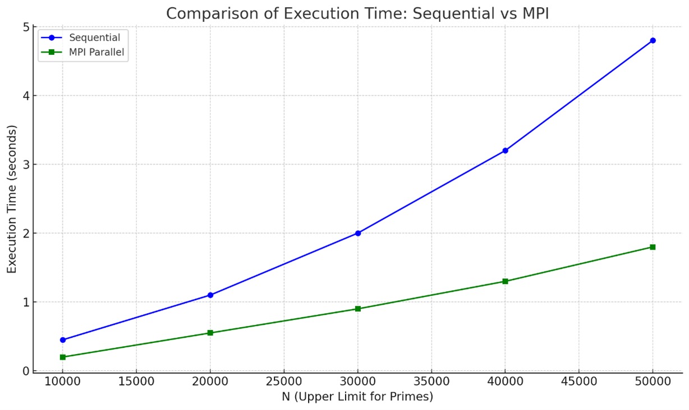

# 📘 Prime Number Computation - Sequential vs Parallel (MPI)

## 📝 Description

This project was developed as part of the **Parallel Computing** course.  
It aims to compare the performance of **sequential** and **parallel (MPI-based)** implementations of a prime number generator.

## 🚀 Objective

To highlight the impact of parallel computing using **MPI (Message Passing Interface)** by comparing execution times between:
- A traditional **sequential** implementation
- A **parallel** implementation using **distributed memory and multiple processes**

## ⚙️ Features

- ✅ Sequential version written in C++ using `<chrono>` to measure execution time.
- ✅ Parallel version using **MPI**, with workload distributed across processes.
- ✅ Execution time output for both implementations.
- ✅ Visual chart showing the performance comparison.

## 🧪 How to Run

### 🔧 Compile

```bash
# Compile the MPI version
mpiexec -np n projectParallelOfPrimeNumber.exe

# Compile the sequential version
g++ -o projectSequentialOfPrimeNumber.cpp
```

## ▶️ Execute
# Run parallel version with n processes
📎 **Note:** This project was tested using **20 processes**, which is the maximum allowed on my current setup.
## 📊 parallel Code 

# Prime numbers up to user-defined 100

# Prime numbers up to user-defined 5000


---

# Run sequential version
## 📊 Sequential Code 

# Prime numbers up to user-defined 100

# Prime numbers up to user-defined 5000


---

A performance comparison chart (image file included)


📎 **Note**: The performance chart is based on illustrative data and may vary depending on system hardware and MPI environment.


---

## 👨‍🎓 Author

**Hassan Youssef Al-Husseini**  
Fifth-year Computer Engineering Student  
This project was developed as part of the **Parallel Computing** course during the graduation year + This project is for academic purposes.
